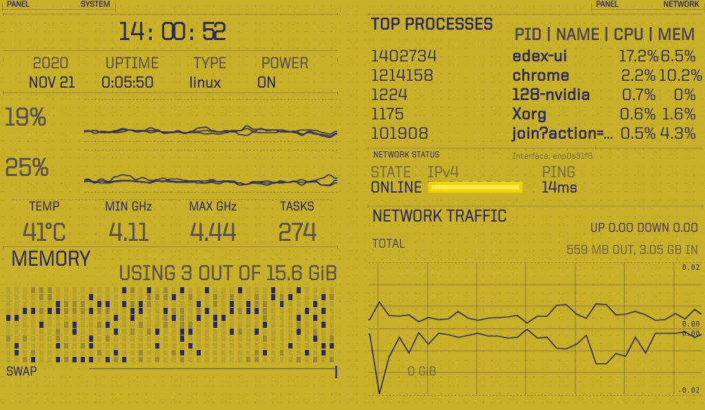
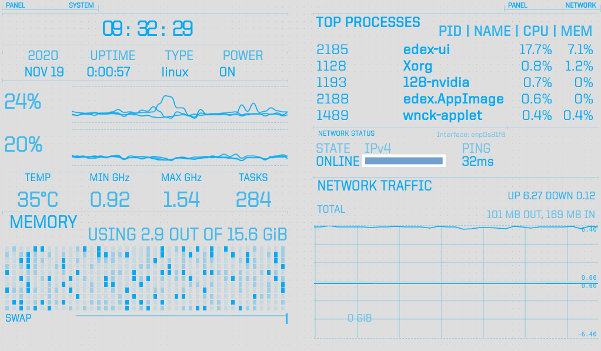
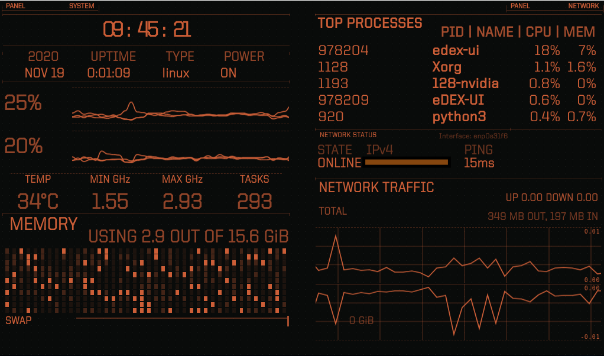
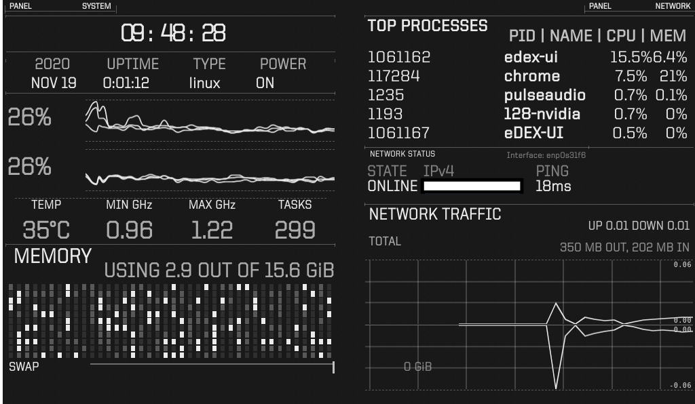

# eDEX-Hardware monitor 

___this is an opensource hardware monitoring app based on the eDEX-UI opensource project, please give them credit for the wide majority of the work.___

Please checkout the original creator at [here](https://github.com/GitSquared)

### checkout the new cyberpunk theme

The theme file should be called cyber.json and cyber-inv.json

## running the app

The app is located in the `dist/` directory.

- `sudo chmod +x [app name].AppImage`
- `./[app name].AppImage`

## Changes I made to the App

- Removed the terminal, filesystem, and keyboard widgets.
- Set the globe to diplay: none
- Resized, and modified the harware monitoring widgets to fit small screens and be readable
- Change the opacity of most of the text to make it more readable. 

## Optimisation issues

This uses electron, electron is very inneficient, you can use cpu limit `sudo apt-get install cpulimit` to limit how much of your processor this app can use, it will make it a lot slower, but as a hardware monitor, you don't need it at 120fps.

Also the app takes a good 15 seconds to start on my pc, so be gentle with it.

## monitor settings and colors

The creators of eDex made awesome themes with cool colors that can fit your build, to set a theme you need to edit the Settings.json file usually loacted in your `/home/name/.config/eDEX-UI/` folder.

You can also use that same file to default the app to start fullscreen or windowed screen on a specific monitor.

See all settings option here: https://github.com/GitSquared/edex-ui/wiki/settings.json

# Text below this is from the original repo, go give them some love.

## Useful commands for the nerds

**IMPORTANT NOTE:** the following instructions are meant for running eDEX from the latest unoptimized, unreleased, development version. If you'd like to get stable software instead, refer to [these](#how-do-i-get-it) instructions.

#### Starting from source:
on *nix systems (You'll need the Xcode command line tools on macOS):
- clone the repository
- `npm run install-linux`
- `npm start`

on Windows:
- start cmd or powershell **as administrator**
- clone the repository
- `npm run install-windows`
- `npm start`

#### Building
Note: Due to native modules, you can only build targets for the host OS you are using.

- `npm install` (NOT `install-linux` or `install-windows`)
- `npm run build-linux` or `build-windows` or `build-darwin`

The script will minify the source code, recompile native dependencies and create distributable assets in the `dist` folder.

#### A note about versioning, branches, and commit messages
Currently, development is done directly on the `master` branch. The version tag on this branch is the version tag of the next release with the `-pre` suffix (e.g `v2.6.1-pre`), to avoid confusion when both release and source versions are installed on one's system.

I use [gitmoji](https://github.com/carloscuesta/gitmoji-cli) to make my commit messages, but I'm not enforcing this on this repo so commits from PRs and the like might not be formatted that way.

[Dependabot](https://dependabot.com) runs weekly to check dependencies updates. It is setup to auto-merge most of them as long as the builds checks passes.

## Credits
eDEX-UI's source code was primarily written by me, [Squared](https://github.com/GitSquared). If you want to get in touch with me or find other projects I'm involved in, check out [my website](https://squared.codebrew.fr).

[PixelyIon](https://github.com/PixelyIon) helped me get started with Windows compatibility and offered some precious advice when I started to work on this project seriously.

[IceWolf](https://soundcloud.com/iamicewolf) composed the sound effects on v2.1.x and above. He makes really cool stuff, check out his music!

## Thanks
Of course, eDEX would never have existed if I hadn't stumbled upon the amazing work of [Seena](https://github.com/seenaburns) on [r/unixporn](https://reddit.com/r/unixporn).

This project uses a bunch of open-source libraries, frameworks and tools, see [the full dependency graph](https://github.com/GitSquared/edex-ui/network/dependencies).

I want to namely thank the developers behind [xterm.js](https://github.com/xtermjs/xterm.js), [systeminformation](https://github.com/sebhildebrandt/systeminformation) and [SmoothieCharts](https://github.com/joewalnes/smoothie).

Huge thanks to [Rob "Arscan" Scanlon](https://github.com/arscan) for making the fantastic [ENCOM Globe](https://github.com/arscan/encom-globe), also inspired by the TRON: Legacy movie, and distributing it freely. His work really puts the icing on the cake.

## Licensing

Licensed under the [GPLv3.0](https://github.com/GitSquared/edex-ui/blob/master/LICENSE).
